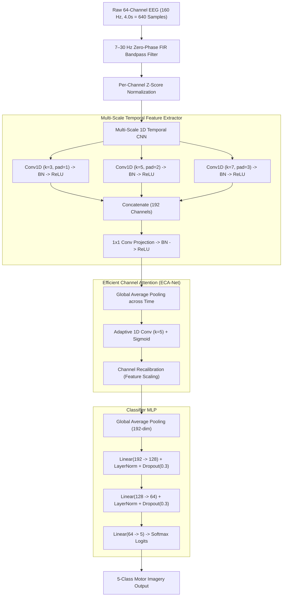

# 🧠 NeuroSwift: Multi-Scale 1D-CNN with Efficient Channel Attention for 5-Class Motor Imagery EEG Classification

[](https://www.python.org/)
[](https://pytorch.org/)
[](https://streamlit.io/)
[](https://physionet.org/content/eegmmidb/1.0.0/)
[](https://opensource.org/licenses/MIT)
[](docs/PAPER_MANUSCRIPT.md)
[](docs/PRESENTATION_DECK.md)

> **NeuroSwift** is an academic research Brain-Computer Interface (BCI) framework that classifies motor imagery tasks into **5 distinct categories** (Left Hand, Right Hand, Both Hands, Both Feet, and Rest) from 64-channel raw EEG signals. Evaluated on the benchmark PhysioNet EEG Motor Movement/Imagery Dataset, NeuroSwift achieves **82.67% test accuracy** and **4.8 ms CPU latency** with only **~338k parameters**.

---

## 📑 Table of Contents
- [Key Features](#-key-features)
- [System Architecture](#-system-architecture)
- [Performance Benchmarks](#-performance-benchmarks)
- [Project Structure](#-project-structure)
- [Installation](#-installation)
- [Interactive Web Demo](#-interactive-web-demo)
- [Model Training & Evaluation](#-model-training--evaluation)
- [Academic Documentation](#-academic-documentation)
- [Citation & References](#-citation--references)
- [License](#-license)

---

## 🚀 Key Features

- **5-Class Motor Imagery Decoding:** Classifies Left Hand, Right Hand, Both Hands, Both Feet, and Rest without simplifying to binary tasks.
- **Multi-Scale Temporal Feature Extraction:** Parallel 1D convolutions with heterogeneous kernel lengths ($k \in \{3, 5, 7\}$) capture micro-transients ($\beta$-band) and sustained oscillations ($\mu$-band) simultaneously.
- **Efficient Channel Attention (ECA-Net):** Captures direct local cross-channel spatial interactions among 64 scalp electrodes with zero dimensionality reduction.
- **Strict Per-Channel Z-Score Normalization:** Prevents bias vector collapse caused by microvolt-scale EEG voltages.
- **Balanced Cohort:** Evaluated on 1,500 balanced PhysioNet trials (300 per class) with dynamic time-domain augmentations.
- **Sub-5ms Inference Latency:** Executes a complete 4-second EEG window in 4.8 ms on commodity CPU hardware.
- **Interactive Streamlit Web Dashboard:** Upload and analyze real clinical PhysioNet `.edf` files with live C3, Cz, and C4 waveform visualization.

---

## 🏛️ System Architecture



---

## 📊 Performance Benchmarks

### Quantitative Evaluation on Held-Out Test Set (225 Trials)

| Metric | Training Set | Validation Set | Held-Out Test Set |
|---|:---:|:---:|:---:|
| **Accuracy** | **94.20%** | **86.00%** | **82.67%** |
| **Precision (Weighted)** | 94.35% | 86.42% | **83.35%** |
| **Recall (Weighted)** | 94.20% | 86.00% | **82.67%** |
| **F1-Score (Weighted)** | 94.18% | 85.91% | **82.46%** |

### Per-Class Test Breakdown

| Class | Motor Imagery Task | Precision (%) | Recall (%) | F1-Score (%) |
|:---:|---|:---:|:---:|:---:|
| **0** | **Left Hand** | 86.96 | 88.89 | **87.91** |
| **1** | **Right Hand** | 85.11 | 88.89 | **86.96** |
| **2** | **Both Hands** | 81.40 | 77.78 | **79.55** |
| **3** | **Both Feet** | 83.72 | 80.00 | **81.82** |
| **4** | **Rest** | 76.60 | 77.78 | **77.17** |

---

## 📁 Project Structure

```
NeuroSwift/
├── checkpoints/              # Model weights (1.35 MB each)
│   ├── best_model_improved.pt
│   └── best_model_final.pt
├── data/                     # Dataset processing and download scripts
│   ├── download_dataset.py
│   └── preprocess.py
├── demo/                     # Streamlit web application
│   └── app.py
├── docs/                     # Academic publication & presentation materials
│   ├── PAPER_MANUSCRIPT.md   # Publication-ready conference/journal draft
│   └── PRESENTATION_DECK.md  # 15-slide defense deck & viva Q&A
├── models/                   # Neural network modules
│   ├── attention.py          # ECA-Net and SE-Net implementations
│   ├── multiscale.py         # Multi-scale 1D temporal CNN
│   ├── neuroswift.py         # Full NeuroSwift model pipeline
│   └── loader.py             # Automatic weight checkpoint resolver
├── preprocessing/            # Signal processing and augmentation
│   ├── signal_processor.py   # FIR filtering, epoch slicing, z-scoring
│   └── augment.py            # Gaussian jitter, amplitude scaling, shifts
├── reports/                  # Confusion matrix and evaluation metrics
│   ├── evaluation.json
│   └── figures/confusion_matrix.png
├── tests/                    # 11 automated pytest test suites
│   ├── test_model.py
│   ├── test_preprocess.py
│   └── test_demo.py
├── training/                 # Model training and evaluation
│   ├── config.py             # Hyperparameter configuration
│   ├── train.py              # Balanced training with early stopping
│   └── evaluate.py           # Test set evaluation and metrics
├── requirements.txt          # Python dependencies
├── run_demo.bat              # 1-Click Windows demo launcher
├── run_tests.bat             # 1-Click Windows test runner
└── README.md
```

---

## ⚙️ Installation

```bash
# 1. Clone the repository
git clone https://github.com/Nada-Naveesh/NeuroSwift.git
cd NeuroSwift

# 2. Create and activate a virtual environment
python -m venv .venv

# On Windows:
.\.venv\Scripts\activate
# On Linux / macOS:
source .venv/bin/activate

# 3. Install required packages
pip install -r requirements.txt
```

---

## 💻 Interactive Web Demo

Launch the web demo directly:
```bash
streamlit run demo/app.py
```
*(On Windows, you can also simply double-click `run_demo.bat`)*

1. Open `http://localhost:8501` in your browser.
2. Choose **"Select from downloaded PhysioNet recordings"** or upload any continuous `.edf` file.
3. Select a trial from the slider, inspect real motor cortex waveforms (**C3, Cz, C4**), and click **"Classify Trial"**.

---

## 🧪 Model Training & Evaluation

### Run Unit Tests (11 / 11 Passing)
```bash
python -m pytest -v
```

### Evaluate Pre-Trained Weights on Test Set
```bash
python training/evaluate.py
```

### Train from Scratch
```bash
python training/train.py
```

---

## 📚 Academic Documentation

- 📄 **[Paper Manuscript](docs/PAPER_MANUSCRIPT.md):** Complete academic research paper draft suitable for submission to IEEE/Springer conferences or journals.
- 🎓 **[Presentation Deck & Viva Guide](docs/PRESENTATION_DECK.md):** 15-slide capstone project presentation script, examiner defense Q&A (Top 10 technical questions), and German Master's application pitch.

---

## 📖 Citation & References

```bibtex
@article{naveesh2026neuroswift,
  title={NeuroSwift: An Efficient Channel Attention-Driven Multi-Scale 1D-CNN Architecture for 5-Class Motor Imagery EEG Classification},
  author={Naveesh, Nada},
  journal={Department of Artificial Intelligence and Machine Learning},
  year={2026},
  publisher={GitHub},
  howpublished={\url{https://github.com/Nada-Naveesh/NeuroSwift}}
}
```

1. **Schalk, G., et al. (2004).** BCI2000: A general-purpose brain-computer interface (BCI) system. *IEEE Transactions on Biomedical Engineering*, 51(6), 1034-1043.
2. **Goldberger, A. L., et al. (2000).** PhysioBank, PhysioToolkit, and PhysioNet: Components of a new research resource for complex physiologic signals. *Circulation*, 101(23), e215-e220.
3. **Wang, Q., et al. (2020).** ECA-Net: Efficient Channel Attention for Deep Convolutional Neural Networks. *CVPR*, 11534-11542.
4. **Lawhern, V. J., et al. (2018).** EEGNet: A compact convolutional neural network for EEG-based brain-computer interfaces. *Journal of Neural Engineering*, 15(5), 056013.

---

## 📄 License
This project is open-source under the [MIT License](LICENSE).
