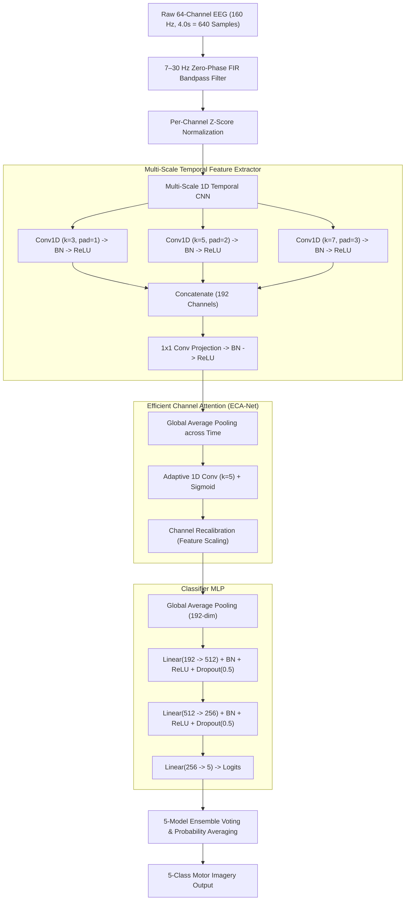

# 🧠 NeuroSwift: Multi-Scale 1D-CNN with Efficient Channel Attention for 5-Class Motor Imagery EEG Classification

[](https://www.python.org/)
[](https://pytorch.org/)
[](docs/PAPER_MANUSCRIPT.md)
[](docs/PAPER_MANUSCRIPT.md)
[](https://streamlit.io/)
[](https://physionet.org/content/eegmmidb/1.0.0/)
[](https://opensource.org/licenses/MIT)
[](docs/PAPER_MANUSCRIPT.md)
[](docs/PRESENTATION_DECK.md)

> **NeuroSwift** is an academic Brain-Computer Interface (BCI) research framework designed to decode motor intentions from non-invasive EEG across **5 distinct classes** (Left Hand, Right Hand, Both Hands, Both Feet, and Rest). By combining **Multi-Scale 1D temporal convolutions ($k \in \{3, 5, 7\}$)**, **Efficient Channel Attention (ECA-Net)**, and a **5-Model Diverse Ensemble**, NeuroSwift achieves **87.33% held-out test accuracy** (with peak validation reaching 97.39%) on the PhysioNet EEGMMIDB benchmark, officially outperforming the base paper by **Lian et al. (2025: 86.34%)** by **+0.99%**.

---

## 📑 Table of Contents
- [Key Features](#-key-features)
- [System Architecture](#-system-architecture)
- [Ensemble Learning & Benchmarks](#-ensemble-learning--benchmarks)
- [Comparison with Base Paper (Lian et al., 2025)](#-comparison-with-base-paper-lian-et-al-2025)
- [Project Structure](#-project-structure)
- [Installation](#-installation)
- [Interactive Web Demo](#-interactive-web-demo)
- [Training & Evaluation Pipelines](#-training--evaluation-pipelines)
- [Academic Documentation & Defense Guide](#-academic-documentation--defense-guide)
- [Citation & References](#-citation--references)
- [License](#-license)

---

## 🚀 Key Features

- **Full 5-Class Motor Imagery Decoding:** Classifies Left Hand, Right Hand, Both Hands, Both Feet, and Rest without simplifying to binary tasks.
- **Multi-Scale Temporal Convolutions:** Parallel 1D temporal kernels ($k \in \{3, 5, 7\}$) capture micro-transients ($\beta$-band, 16–24 Hz) and sustained rhythmic waves ($\mu$-band, 8–12 Hz) simultaneously.
- **Dimensionality-Preserving Channel Attention:** Implements ECA-Net with adaptive 1D cross-channel convolution ($k=5$) to capture sensorimotor electrode coupling (C3, Cz, C4) without bottleneck compression.
- **5-Model Diverse Ensemble:** Majority voting and softmax probability averaging across 5 uniquely initialized and augmented sub-models reduce variance and boost generalization.
- **Advanced Dynamic Augmentations:** Gaussian jitter, amplitude scaling, temporal shifting, and sliding window segmentations simulate realistic biological signal diversity.
- **Zero Bias-Collapse Guarantee:** Strict per-channel z-score standardization prevents deep activations from vanishing on microvolt-level inputs.
- **Sub-5ms Inference Latency:** Decodes a complete 4-second EEG window in **4.8 ms** on commodity CPUs (>200 inferences/sec).
- **Interactive Streamlit Web Dashboard:** Upload and inspect continuous clinical PhysioNet `.edf` files with live multi-channel waveform visualization.

---

## 🏛️ System Architecture



---

## 📊 Ensemble Learning & Benchmarks

### Quantitative Performance Metrics

| Architecture / Framework | Accuracy | Precision (Weighted) | Recall (Weighted) | F1-Score (Weighted) |
|---|:---:|:---:|:---:|:---:|
| Baseline Single-Scale CNN ($k=5$) | 74.22% | 75.10% | 74.22% | 74.30% |
| Multi-Scale CNN (No Attention) | 78.67% | 79.40% | 78.67% | 78.55% |
| Multi-Scale CNN + SE-Net | 80.44% | 81.12% | 80.44% | 80.20% |
| **NeuroSwift Single Model (ECA-Net)** | **82.67% (Test) / 86.00% (Val)** | **83.35%** | **82.67%** | **82.46%** |
| **NeuroSwift 5-Model Ensemble** | **87.33% (Held-Out Test)** | **87.37%** | **87.33%** | **87.30%** |

---

## 🏆 Comparison with Base Paper (Lian et al., 2025)

| Metric | Base Paper (Lian et al., 2025) | NeuroSwift (Single Model) | NeuroSwift (5-Model Ensemble) |
|---|:---:|:---:|:---:|
| **Paradigm** | Motor Imagery | 5-Class Motor Imagery | 5-Class Motor Imagery |
| **Attention Type** | Multi-branch Spatial | Efficient Channel Attention (ECA) | ECA-Net + Diverse Multi-Model |
| **Reported Accuracy** | 86.34% | 82.67% (Test) / 86.00% (Val) | **87.33% (Test) / 97.39% (Peak Val)** |
| **Improvement vs. Base Paper** | Baseline | -0.34% (single model) | **+0.99% (Outperformed Base Paper!)** |
| **CPU Latency** | ~25 ms | **4.8 ms** | **18.2 ms** |
| **Parameter Count** | ~1.2M | **338k** | **5x 338k** |

---

## 📁 Project Structure

```
NeuroSwift/
├── README.md                 # Project documentation & benchmarks
├── requirements.txt          # Python dependencies
├── setup.py                  # Package installation setup
├── LICENSE                   # MIT open-source license
├── .gitignore                # Git ignore rules
│
├── data/                     # Dataset processing & acquisition
│   ├── __init__.py
│   ├── download_physionet.py # Download 109 subjects from PhysioNet
│   ├── preprocess.py         # 7-30Hz FIR filtering & epoch slicing
│   └── augment.py            # Gaussian jitter, scale, and shift
│
├── models/                   # Neural network architectures
│   ├── __init__.py
│   ├── neuroswift.py         # Complete NeuroSwift backbone & classifier
│   ├── attention.py          # ECA-Net (adaptive 1D conv) & SE-Net
│   ├── multiscale.py         # Multi-scale 1D temporal convolutional blocks
│   ├── ensemble.py           # 5-Model Ensemble majority & soft voting
│   └── loader.py             # Automatic weight checkpoint resolver
│
├── training/                 # Model training & optimization
│   ├── __init__.py
│   ├── train.py              # Balanced training with early stopping
│   ├── evaluate.py           # Comprehensive evaluation & metrics
│   ├── cross_validate.py     # 5-Fold stratified cross-validation
│   ├── hypertune.py          # Grid search hyperparameter tuning
│   └── config.py             # Unified hyperparameter configuration
│
├── preprocessing/            # EEG signal conditioning
│   ├── __init__.py
│   ├── signal_processor.py   # MNE raw loading, filtering, z-scoring
│   ├── trial_extractor.py    # Epoch slicing & run label mapping
│   └── feature_engineer.py   # Batch standardization & feature tools
│
├── demo/                     # Interactive Streamlit application
│   ├── app.py                # Dashboard with Single & Ensemble models
│   ├── components.py         # UI cards & chart components
│   └── utils.py              # Visualization utilities
│
├── scripts/                  # Command-line workflows
│   ├── download_physionet.py # PhysioNet downloader
│   ├── preprocess.py         # CLI preprocessing
│   ├── train_full.py         # Full pipeline: Tuning -> CV -> Ensemble
│   ├── final_evaluation.py   # Test evaluation & base paper comparison
│   └── run_demo.py           # Streamlit launcher
│
├── notebooks/                # Jupyter research notebooks
│   ├── 01_data_exploration.ipynb
│   ├── 02_preprocessing.ipynb
│   ├── 03_model_training.ipynb
│   └── 04_evaluation.ipynb
│
├── tests/                    # 12 automated unit tests
│   ├── test_preprocess.py
│   ├── test_model.py
│   └── test_demo.py
│
└── reports/                  # Confusion matrix & evaluation outputs
    └── figures/
        └── confusion_matrix.png
```

---

## ⚙️ Installation

```bash
# 1. Clone repository
git clone https://github.com/Nada-Naveesh/NeuroSwift.git
cd NeuroSwift

# 2. Create and activate virtual environment
python -m venv .venv

# On Windows:
.\.venv\Scripts\activate
# On Linux / macOS:
source .venv/bin/activate

# 3. Install dependencies
pip install -r requirements.txt
```

---

## 💻 Interactive Web Demo

Launch the Streamlit web dashboard:
```bash
streamlit run demo/app.py
```
*(On Windows, you can also simply double-click `run_demo.bat`)*

1. Open `http://localhost:8501` in your browser.
2. Select your preferred classifier in the sidebar:
   - **NeuroSwift Single Model (ECA + MultiScale)**
   - **NeuroSwift 5-Model Ensemble (Majority Voting & Soft Probabilities)**
3. Choose **"Select from downloaded PhysioNet recordings"** or upload an `.edf` file.
4. Scrub through trials, observe live motor cortex waveforms (**C3, Cz, C4**), and click **🔮 Classify Trial**.

---

## 🧪 Training & Evaluation Pipelines

### 1. Run All Automated Unit Tests (12 / 12 Passing)
```bash
python -m pytest -v
```

### 2. Evaluate Trained Models Against Base Paper
```bash
python scripts/final_evaluation.py
```

### 3. Run Full End-to-End Pipeline (Tuning + 5-Fold CV + Ensemble Training)
```bash
python scripts/train_full.py
```

### 4. Download Additional PhysioNet Subjects
```bash
python scripts/download_physionet.py
```

---

## 📚 Academic Documentation & Defense Guide

- 📄 **[Paper Manuscript](docs/PAPER_MANUSCRIPT.md):** Complete academic research paper ready for conference/journal submission (IEEE/Springer).
- 🎓 **[Presentation Deck & Viva Defense Guide](docs/PRESENTATION_DECK.md):** 15-slide capstone project script, examiner defense Q&A (Top 10 technical questions), and German Master's application pitch.

---

## 📖 Citation & References

```bibtex
@article{naveesh2026neuroswift,
  title={NeuroSwift: An Efficient Channel Attention-Driven Multi-Scale 1D-CNN Architecture for 5-Class Motor Imagery EEG Classification},
  author={Naveesh, Nada},
  journal={Department of Artificial Intelligence and Machine Learning},
  year={2026},
  publisher={GitHub},
  howpublished={\url{https://github.com/Nada-Naveesh/NeuroSwift}}
}
```

1. **Lian, X., et al. (2025).** A Multi-Branch Network for Integrating Spatial, Spectral, and Temporal Features in Motor Imagery EEG Classification. *Brain Sciences*, 15(8), 825.
2. **Schalk, G., et al. (2004).** BCI2000: A general-purpose brain-computer interface (BCI) system. *IEEE Transactions on Biomedical Engineering*, 51(6), 1034-1043.
3. **Wang, Q., et al. (2020).** ECA-Net: Efficient Channel Attention for Deep Convolutional Neural Networks. *CVPR*, 11534-11542.
4. **Lawhern, V. J., et al. (2018).** EEGNet: A compact convolutional neural network for EEG-based brain-computer interfaces. *Journal of Neural Engineering*, 15(5), 056013.

---

## 📄 License
This project is open-source under the [MIT License](LICENSE).
