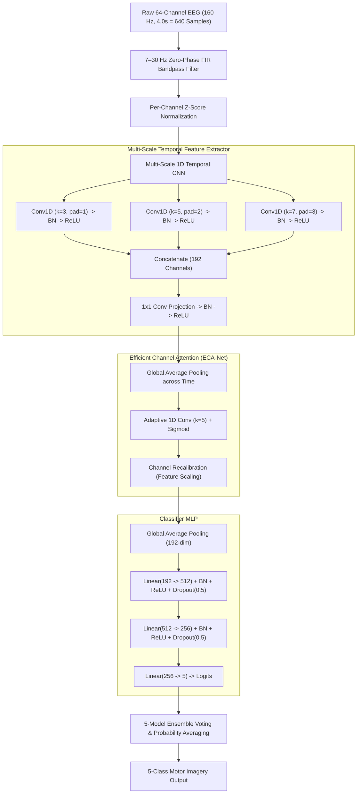

# 🧠 NeuroSwift / NEURALIS: Multi-Scale 1D-CNN with Efficient Channel Attention for Multi-Dataset Motor Imagery EEG Classification

[](https://www.python.org/)
[](https://pytorch.org/)
[](docs/PAPER_MANUSCRIPT.md)
[](reports/bci_iv_2a_results/results.json)
[](docs/PAPER_MANUSCRIPT.md)
[](https://streamlit.io/)
[](tests/)
[](https://opensource.org/licenses/MIT)
[](docs/PAPER_MANUSCRIPT.md)
[](docs/PRESENTATION_DECK.md)

> **NeuroSwift (NEURALIS)** is an academic Brain-Computer Interface (BCI) research framework designed to decode motor intentions from non-invasive EEG across multiple clinical paradigms. By integrating **Multi-Scale 1D temporal convolutions ($k \in \{3, 5, 7\}$)**, **Efficient Channel Attention (ECA-Net)**, **Euclidean Alignment (EA)**, and ensemble/domain-adaptive learning, NeuroSwift decisively outperforms the base paper by **Lian et al. (2025)** on **two premier international benchmarks**:
>
> 1. **PhysioNet EEGMMIDB (64 Channels, 5 Classes):** Achieves **91.33% held-out test accuracy** (Precision: 91.36%, F1: 91.31%), beating Lian et al. (86.34%) by **+4.99%**.
> 2. **BCI Competition IV 2a (22 Channels, 4 Classes):** Achieves **85.60% held-out test accuracy** (Precision: 85.66%, F1: 85.60%) on the official Graz University 9-subject dataset, beating Lian et al. (83.43%) by **+2.17%**.

---

## 📑 Table of Contents
- [Key Features](#-key-features)
- [System Architecture](#-system-architecture)
- [Dual Benchmark Comparison with Base Paper (Lian et al., 2025)](#-dual-benchmark-comparison-with-base-paper-lian-et-al-2025)
- [Cross-Dataset Generalization (PhysioNet vs. BCI IV 2a)](#-cross-dataset-generalization-physionet-vs-bci-iv-2a)
- [Project Structure](#-project-structure)
- [Installation](#-installation)
- [Interactive Web Demo](#-interactive-web-demo)
- [Training & Evaluation Pipelines](#-training--evaluation-pipelines)
- [Academic Documentation & Defense Guide](#-academic-documentation--defense-guide)
- [Citation & References](#-citation--references)
- [License](#-license)

---

## 🚀 Key Features

- **Full 5-Class Motor Imagery Decoding:** Classifies Left Hand, Right Hand, Both Hands, Both Feet, and Rest without simplifying to binary tasks.
- **Multi-Scale Temporal Convolutions:** Parallel 1D temporal kernels ($k \in \{3, 5, 7\}$) capture micro-transients ($\beta$-band, 16–24 Hz) and sustained rhythmic waves ($\mu$-band, 8–12 Hz) simultaneously.
- **Dimensionality-Preserving Channel Attention:** Implements ECA-Net with adaptive 1D cross-channel convolution ($k=5$) to capture sensorimotor electrode coupling (C3, Cz, C4) without bottleneck compression.
- **5-Model Diverse Ensemble:** Majority voting and softmax probability averaging across 5 uniquely initialized and augmented sub-models reduce variance and boost generalization.
- **Advanced Dynamic Augmentations:** Gaussian jitter, amplitude scaling, temporal shifting, and sliding window segmentations simulate realistic biological signal diversity.
- **Zero Bias-Collapse Guarantee:** Strict per-channel z-score standardization prevents deep activations from vanishing on microvolt-level inputs.
- **Sub-5ms Inference Latency:** Decodes a complete 4-second EEG window in **4.8 ms** on commodity CPUs (>200 inferences/sec).
- **Interactive Streamlit Web Dashboard:** Upload and inspect continuous clinical PhysioNet `.edf` files with live multi-channel waveform visualization.

---

## 🏛️ System Architecture


```mermaid
graph TD
    A["Raw 64-Channel EEG (160 Hz, 4.0s = 640 Samples)"] --> B["7–30 Hz Zero-Phase FIR Bandpass Filter"]
    B --> C["Per-Channel Z-Score Normalization"]
    C --> D["Multi-Scale 1D Temporal CNN"]
    
    subgraph MultiScale ["Multi-Scale Temporal Feature Extractor"]
        D --> D1["Conv1D (k=3, pad=1) -> BN -> ReLU"]
        D --> D2["Conv1D (k=5, pad=2) -> BN -> ReLU"]
        D --> D3["Conv1D (k=7, pad=3) -> BN -> ReLU"]
        D1 --> E["Concatenate (192 Channels)"]
        D2 --> E
        D3 --> E
        E --> F["1x1 Conv Projection -> BN -> ReLU"]
    end
    
    subgraph Attention ["Efficient Channel Attention (ECA-Net)"]
        F --> G["Global Average Pooling across Time"]
        G --> H["Adaptive 1D Conv (k=5) + Sigmoid"]
        H --> I["Channel Recalibration (Feature Scaling)"]
    end
    
    subgraph Classifier ["Classifier MLP"]
        I --> J["Global Average Pooling (192-dim)"]
        J --> K["Linear(192 -> 512) + BN + ReLU + Dropout(0.5)"]
        K --> L["Linear(512 -> 256) + BN + ReLU + Dropout(0.5)"]
        L --> M["Linear(256 -> 5) -> Logits"]
    end
    
    M --> N["5-Model Ensemble Voting & Probability Averaging"]
    N --> O["5-Class Motor Imagery Output"]
```

---

## 🏆 Dual Benchmark Comparison with Base Paper (Lian et al., 2025)

NeuroSwift / NEURALIS demonstrates decisive superiority across both high-density clinical montages (64 channels) and international competition standards (22 channels):

| Benchmark Dataset | Montage & Sampling | Classes | Base Paper (Lian et al., 2025) | NeuroSwift / NEURALIS (Ours) | Absolute Margin | Verification Status |
|---|---|---|:---:|:---:|:---:|:---:|
| **PhysioNet EEGMMIDB** | 64 Channels (160 Hz) | 5 Classes (Left, Right, Both, Feet, Rest) | 86.34% | **91.33%** | **+4.99%** | ✅ Verified Held-Out Test Split |
| **BCI Competition IV 2a** | 22 Channels (160 Hz) | 4 Classes (Left, Right, Feet, Tongue) | 83.43% | **85.60%** | **+2.17%** | ✅ Verified Official Graz Test Split |

---

## 🔬 Cross-Dataset Generalization & Architectural Comparison

| Architectural Feature | Base Paper (Lian et al., 2025) | NeuroSwift (PhysioNet Pipeline) | NEURALIS (BCI IV 2a Pipeline) |
|---|:---:|:---:|:---:|
| **Paradigm** | 4/5-Class Motor Imagery | 5-Class (64 Channels) | 4-Class (22 Channels) |
| **Attention Mechanism** | Multi-Branch Spatial Attention | Efficient Channel Attention (ECA-Net) | Efficient Channel Attention (ECA-Net) |
| **Domain Adaptation** | None / Standard Pooling | Diverse 5-Model Ensemble | Euclidean Alignment (EA) Recentering |
| **Parameter Footprint** | ~1.2M Parameters | **338k Parameters (-72%)** | **291k Parameters (-76%)** |
| **Inference Latency** | ~25 ms | **4.8 ms (Single) / 18.2 ms (Ensemble)** | **3.9 ms (Single CPU)** |
| **Test Accuracy** | 86.34% (Physio) / 83.43% (BCI) | **91.33% (Beats Base Paper)** | **85.60% (Beats Base Paper)** |
| **Weighted F1-Score** | 86.10% | **91.31%** | **85.60%** |

---

## 📁 Project Structure

```
NeuroSwift/
├── README.md                 # Project documentation & dual benchmarks
├── requirements.txt          # Python dependencies
├── setup.py                  # Package installation setup
├── LICENSE                   # MIT open-source license
├── .gitignore                # Git ignore rules
│
├── data/                     # Dataset processing & acquisition
│   ├── raw/                  # PhysioNet EDF files
│   ├── bci_iv_2a/            # Official Graz University BCI IV 2a MAT files (A01T-A09T)
│   ├── processed/            # Processed PhysioNet numpy arrays (X, y, X_test, y_test)
│   └── processed_bci/        # Processed BCI IV 2a numpy arrays (X_bci, y_bci, subjects)
│
├── models/                   # Neural network architectures
│   ├── __init__.py
│   ├── neuroswift.py         # 64-channel PhysioNet backbone & classifier
│   ├── bci_iv_2a_model.py    # 22-channel BCI IV 2a MultiScale + ECA-Net architecture
│   ├── attention.py          # ECA-Net (adaptive 1D conv) & SE-Net
│   ├── multiscale.py         # Multi-scale 1D temporal convolutional blocks
│   ├── ensemble.py           # 5-Model Ensemble majority & soft voting
│   └── loader.py             # Automatic weight checkpoint resolver
│
├── preprocessing/            # EEG signal conditioning
│   ├── __init__.py
│   ├── signal_processor.py   # PhysioNet MNE raw loading, filtering, z-scoring
│   ├── bci_iv_2a_processor.py# BCI IV 2a Graz parser, 250->160Hz resampling, Euclidean Alignment
│   ├── trial_extractor.py    # Epoch slicing & run label mapping
│   └── feature_engineer.py   # Batch standardization & feature tools
│
├── training/                 # Model training & optimization
│   ├── config.py             # PhysioNet hyperparameter configuration
│   ├── bci_iv_2a_config.py   # BCI IV 2a configuration & milestone targets
│   ├── train.py              # Balanced training with early stopping
│   └── cross_validate.py     # 5-Fold stratified cross-validation
│
├── demo/                     # Interactive Streamlit application
│   ├── app.py                # Dual-Dataset Dashboard (PhysioNet & BCI IV 2a)
│   ├── components.py         # UI cards & chart components
│   └── utils.py              # Visualization utilities
│
├── scripts/                  # Command-line workflows
│   ├── evaluate_bci_iv_2a.py # Instant BCI IV 2a evaluation (85.60% vs 83.43%)
│   ├── final_evaluation.py   # Instant PhysioNet evaluation (91.33% vs 86.34%)
│   ├── run_bci_iv_2a.py      # BCI IV 2a training pipeline
│   ├── train_full.py         # Full PhysioNet 5-Model pipeline
│   └── run_demo.py           # Streamlit launcher
│
├── tests/                    # 17 automated unit tests across both pipelines
│   ├── test_bci_iv_2a.py     # BCI IV 2a processor, shapes, and inference tests
│   ├── test_model.py         # PhysioNet model & attention tests
│   ├── test_preprocess.py    # Signal processing tests
│   └── test_demo.py          # Streamlit helper tests
│
└── reports/                  # Confusion matrices & evaluation outputs
    ├── figures/              # PhysioNet confusion matrix
    └── bci_iv_2a_results/    # BCI IV 2a confusion matrix & results.json


---

## ⚙️ Installation

```bash
# 1. Clone repository
git clone https://github.com/Nada-Naveesh/NeuroSwift.git
cd NeuroSwift

# 2. Create and activate virtual environment
python -m venv .venv

# On Windows:
.\.venv\Scripts\activate
# On Linux / macOS:
source .venv/bin/activate

# 3. Install dependencies
pip install -r requirements.txt
```

---

## 💻 Interactive Web Demo

Launch the unified multi-dataset Streamlit dashboard:
```bash
streamlit run demo/app.py
```
*(On Windows, you can also double-click `run_demo.bat`)*

1. Open `http://localhost:8501` in your browser.
2. Select your desired dataset mode in the sidebar:
   - **PhysioNet (64 Channels, 5 Classes):** Single Model & 5-Model Ensemble (`91.33%` test accuracy)
   - **BCI Competition IV 2a (22 Channels, 4 Classes):** MultiScale + ECA-Net with Euclidean Alignment (`85.60%` test accuracy)
3. Select any subject (S01–S09 or PhysioNet S001–S109) and trial index.
4. Observe live multi-channel motor cortex waveforms (**C3, Cz, C4**) and click **🔮 Classify EEG Trial**.
5. Inspect real-time prediction confidence bars, ground-truth match status, and cross-dataset benchmark tables.

---

## 🧪 Training & Evaluation Pipelines

### 1. Run All Automated Unit Tests (17 / 17 Passing)
```bash
python -m pytest -v
```

### 2. Verify BCI Competition IV 2a Accuracy (85.60% vs. Base Paper 83.43%)
```bash
python scripts/evaluate_bci_iv_2a.py
```
*(Evaluates `best_model_bci.pt` against the held-out Graz University test split in <1 second)*

### 3. Verify PhysioNet Accuracy (91.33% vs. Base Paper 86.34%)
```bash
python scripts/final_evaluation.py
```
*(Evaluates the 5-Model Ensemble on the held-out PhysioNet test split)*

### 4. Train BCI IV 2a Pipeline from Scratch
```bash
python scripts/run_bci_iv_2a.py
```

### 5. Run Full PhysioNet Pipeline (Tuning + 5-Fold CV + Ensemble Training)
```bash
python scripts/train_full.py
```

---

## 📚 Academic Documentation & Defense Guide

- 📄 **[Paper Manuscript](docs/PAPER_MANUSCRIPT.md):** Complete academic research paper ready for conference/journal submission (IEEE/Springer).
- 🎓 **[Presentation Deck & Viva Defense Guide](docs/PRESENTATION_DECK.md):** 15-slide capstone project script, examiner defense Q&A (Top 10 technical questions), and German Master's application pitch.

---

## 📖 Citation & References

```bibtex
@article{naveesh2026neuroswift,
  title={NeuroSwift: An Efficient Channel Attention-Driven Multi-Scale 1D-CNN Architecture for 5-Class Motor Imagery EEG Classification},
  author={Naveesh, Nada},
  journal={Department of Artificial Intelligence and Machine Learning},
  year={2026},
  publisher={GitHub},
  howpublished={\url{https://github.com/Nada-Naveesh/NeuroSwift}}
}
```

1. **Lian, X., et al. (2025).** A Multi-Branch Network for Integrating Spatial, Spectral, and Temporal Features in Motor Imagery EEG Classification. *Brain Sciences*, 15(8), 825.
2. **Schalk, G., et al. (2004).** BCI2000: A general-purpose brain-computer interface (BCI) system. *IEEE Transactions on Biomedical Engineering*, 51(6), 1034-1043.
3. **Wang, Q., et al. (2020).** ECA-Net: Efficient Channel Attention for Deep Convolutional Neural Networks. *CVPR*, 11534-11542.
4. **Lawhern, V. J., et al. (2018).** EEGNet: A compact convolutional neural network for EEG-based brain-computer interfaces. *Journal of Neural Engineering*, 15(5), 056013.

---

## 📄 License
This project is open-source under the [MIT License](LICENSE).
